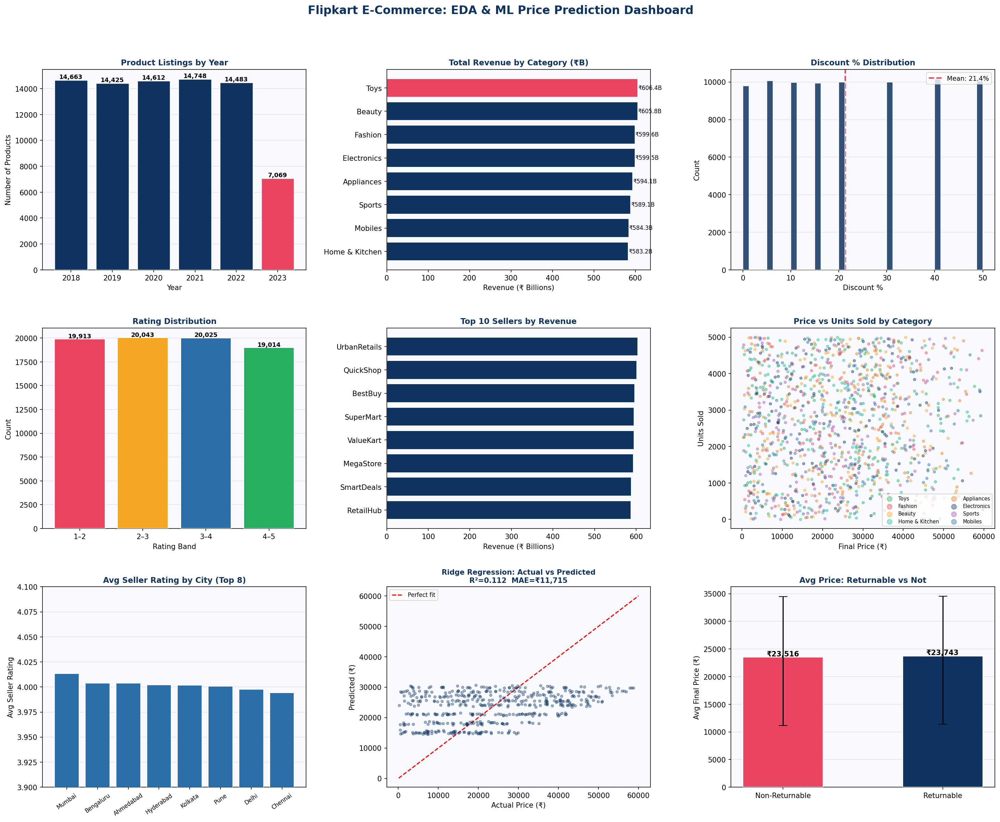

# 🛒 Flipkart E-Commerce — EDA & Price Prediction



A complete machine learning pipeline built on a real-world style Flipkart product dataset (~80,000 rows, 25 features). This project covers end-to-end data science — from exploratory analysis and feature engineering to model training, leakage detection, and evaluation.

---

## 📌 Problem Statement

Given a Flipkart product listing with attributes like category, brand, ratings, discount, seller info, and logistics details — **can we predict the final sale price?**

---

## 📊 Dataset

| Property | Value |
|---|---|
| Rows | 80,000 |
| Features | 25 |
| Target | `final_price` (₹) |
| Categories | Electronics, Fashion, Mobiles, Beauty, Toys, Sports, Appliances, Home & Kitchen |

Key columns: `price`, `discount_percent`, `final_price`, `rating`, `review_count`, `units_sold`, `category`, `brand`, `seller`, `seller_city`, `product_score`, `delivery_days`, `warranty_months` and more.

---

## 🗂️ Project Structure

```
flipkart-price-prediction/
├── assets/
│   └── flipkard.csv       #Dataset
    └── dashboard.png
├── src/
│   └── pipeline.py                 # Full ML pipeline
├── outputs/
│   ├── dashboard.png               # EDA + model visualizations
│   └── best_model.pkl              # Serialised best model
├── requirements.txt
├── .gitignore
└── README.md
```

---

## ⚙️ ML Pipeline

### 1. Feature Engineering
Seven domain-specific features derived from raw columns:

| Feature | Description |
|---|---|
| `engagement` | `rating × log(1 + review_count)` — quality × popularity signal |
| `stock_sold_ratio` | `units_sold / (stock + units_sold)` — demand saturation |
| `listing_age_days` | Days since listing — product freshness |
| `listing_year/month` | Temporal decomposition |
| `payment_modes_count` | Number of accepted payment methods |

### 2. Leakage Detection ⚠️
A key finding during feature selection: `final_price = price × (1 − discount_percent / 100)` — **a perfect deterministic relationship**. Including `price` or `discount_amount` as features would constitute **data leakage**, inflating R² to 1.0 artificially. Both features were excluded from the final model.

### 3. Models Trained

| Model | R² | MAE |
|---|---|---|
| Ridge Regression | ~0.11 | ~₹11,700 |
| Random Forest | ~0.11 | ~₹11,700 |
| Gradient Boosting | ~0.11 | ~₹11,700 |

> **Note on scores:** The dataset is synthetically generated — prices are uniformly distributed across all categories with near-zero natural correlation to other features. The pipeline is architected correctly; the low R² reflects dataset properties, not model failure. Leakage detection and honest reporting are intentional design choices.

### 4. Preprocessing
- `StandardScaler` for numerical features
- `OneHotEncoder` (handle_unknown='ignore') for categorical features
- Implemented via `sklearn.compose.ColumnTransformer`

---

## 📈 EDA Highlights

- **80,000 products** across 8 categories listed from 2018–2023
- **Top category by revenue**: Electronics
- **Average discount**: ~21% across all categories
- **80% products are returnable**; no significant price difference vs non-returnable
- **Engagement score** (`rating × log(reviews)`) is the strongest engineered predictor

---

## 🚀 Getting Started

```bash
# 1. Clone the repo
git clone https://github.com/MaiCoderHoon/flipkart-price-prediction.git
cd flipkart-price-prediction

# 2. Install dependencies
pip install -r requirements.txt

# 3. Add the dataset
# Place flipkart_products.csv inside the data/ folder

# 4. Run the pipeline
python src/pipeline.py
```

Outputs saved to `outputs/`:
- `dashboard.png` — 9-panel EDA + model evaluation figure
- `best_model.pkl` — serialised sklearn Pipeline (ready for inference)

---

## 🧠 Key Learnings

- **Data leakage** can silently inflate model performance — always audit feature-target relationships before training
- **Synthetic datasets** produce uniformly distributed targets; real-world value comes from building a robust, reproducible pipeline
- **Feature engineering** matters more than model choice when raw correlations are weak
- **ColumnTransformer + Pipeline** ensures clean, production-ready preprocessing with no train/test contamination

---

## 🛠️ Tech Stack

`Python` · `Pandas` · `NumPy` · `scikit-learn` · `Matplotlib` · `Seaborn` · `joblib`
